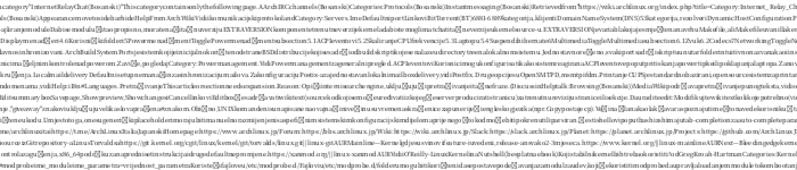

# book2png

Put an entire book into one PNG image, or encode any file into a PNG reversibly. Zero runtime dependencies, built with Zig 0.16.

- `flow`: reflow the text into one tall PNG. Line breaks and spaces are stripped by default (good for CJK); pass `--latin-space` to keep ASCII spaces in Latin text.
- `pixel`: encode header and every byte of the input into a square grayscale PNG.
- `decode`: restore the original bytes from a `pixel` PNG.
- `fonts`: list the system font paths the program probes.

Input: `.epub`, `.html`/`.htm`/`.xhtml`, or any plain-text file. Building needs Zig 0.16.0 and a target libc. EPUB/ZIP, zlib and PNG handling use the Zig standard library or in-repo code; rasterization uses vendored [stb_truetype](https://github.com/nothings/stb).

## Build

Prebuilt archives for Linux x86_64/aarch64, macOS x86_64/arm64 and Windows x86_64 are on the [releases page](../../releases). From source:

```bash
git clone https://github.com/VKKKV/book2png.git
cd book2png
zig build -Doptimize=ReleaseFast   # -> zig-out/bin/book2png
zig build test
```

## Usage

```text
book2png flow   <input> <output.png> [options]
book2png pixel  <input> <output.png>
book2png decode <input.png> <output>
book2png fonts
```

```bash
# EPUB -> one tall image
book2png flow book.epub book.png

# Latin text: keep the spaces between words
book2png flow alice.epub alice.png --latin-space

# Smaller output, no antialiasing
book2png flow book.epub book-1bit.png --bilevel

# Any file -> PNG -> original file
book2png pixel book.epub book-pixel.png
book2png decode book-pixel.png restored.epub
sha256sum book.epub restored.epub
```

`pixel`/`decode` is a byte-exact round trip; the PNG must not pass through JPEG or any platform that rewrites pixels.

### `flow` options

- `--width <px>`: image width, default `2000`.
- `--size <px>`: font size, default `16`; must be positive.
- `--font <path>`: `.ttf`, `.otf` or `.ttc`, absolute or relative. Default probes Source Han, Noto, WenQuanYi, DejaVu, PingFang and Windows fonts per platform.
- `--margin <px>`: margin on all sides, default `0`.
- `--leading <f>`: line-height multiplier, default `1.15`; must be positive and finite.
- `--latin-space`: keep ASCII spaces (recommended for Latin, usually off for CJK).
- `--bilevel`: 1-bit black/white PNG, much smaller than grayscale but without antialiasing.
- `--level <n>`: deflate level `1`-`9`; `1-4` fast, `5-7` default, `8-9` best. Default `6`.
- `--quiet`: suppress the statistics line.

HTML/XML tags are converted to text; `script`, `style`, `head` and `title` are skipped and common entities decoded. EPUB content documents are read in spine order. Images, formula graphics and the original page layout are not part of the `flow` output.

## Cross-compilation

```bash
zig build -Doptimize=ReleaseFast -Dtarget=aarch64-linux-gnu
zig build -Doptimize=ReleaseFast -Dtarget=x86_64-windows-gnu
zig build -Doptimize=ReleaseFast -Dtarget=aarch64-macos
```

CI builds and tests on Linux, macOS and Windows and checks the aarch64-linux, x86_64-windows and aarch64-macos cross targets. A `v*` tag makes the release workflow publish archives for five platforms.

## Measured

Numbers come from the samples in this repository; time and size depend on font, input, CPU, compression level and filesystem.

- *Dream of the Red Chamber* EPUB, 786k CJK characters, `--width 2000 --size 13`: `2000 × 52665`, ~25 MB grayscale, ~11 s.
- Same input with `--bilevel`: `2000 × 52665`, ~4.5 MB, ~10 s.
- *Alice in Wonderland* EPUB, `--width 2000 --size 13 --latin-space`: `2000 × 5400`, ~1.2 MB, ~0.7 s.
- 1.1 MB file through `pixel` + `decode`: `1073 × 1073`, ~1.1 MB PNG, ~30 ms, SHA-256 match.

## Example: the whole Arch Wiki as one PNG

Uses Arch's official offline documentation package (39 languages, 5,822 HTML pages, ~206 MB) instead of crawling the site.

```bash
curl -L -o arch-wiki-docs.pkg.tar.zst \
  https://archlinux.org/packages/extra/any/arch-wiki-docs/download/
bsdtar -xf arch-wiki-docs.pkg.tar.zst usr/share/doc/arch-wiki/html

find usr/share/doc/arch-wiki/html -name '*.html' -print0 | sort -z \
  | xargs -0 cat > archwiki.html

book2png flow archwiki.html archwiki.png --width 12000 --size 8
book2png flow archwiki.html archwiki-1bit.png --width 12000 --size 8 --bilevel
```

Result: `12000 × 101110` for 40.1 M characters. The grayscale version is ~184 MB in ~179 s — zoom in for OCR, it is hard to read by eye; the `--bilevel` version is ~24 MB in ~195 s, but 8px Latin letters lose readability.

Preview (4× zoom):



## Design and limits

- Rendering is two-pass: the first pass only records line breaks, the second rasterizes and writes line by line, so no buffer the size of the whole image is allocated. Input text, font and compressed data are held in memory.
- `pixel` writes a 12-byte header at the start of the pixel data — magic `B2P1` plus the original file length — so `decode` needs no sidecar metadata.
- `flow` keeps the text layer only; EPUB illustrations, formula images, CSS layout and page styling are not rendered. Use a PDF renderer when layout matters.
- `--bilevel` replaces grayscale antialiasing with a black/white threshold: good for compression and posters, but use the default grayscale mode for small text.
- Output height grows with text volume and line height, and viewers have their own size limits; images hundreds of thousands of pixels tall are best browsed in tiles, e.g. `vips dzsave` with OpenSeadragon or IIIF.
- CJK fonts usually have larger ascent/descent than Latin fonts, so `--size 13` can end up near 19px of line box — normal font-metric behaviour.

## License

GPL-3.0, see [LICENSE](LICENSE).

`vendor/stb_truetype.h` is Sean Barrett's public domain / MIT licensed code; see the header of that file.
